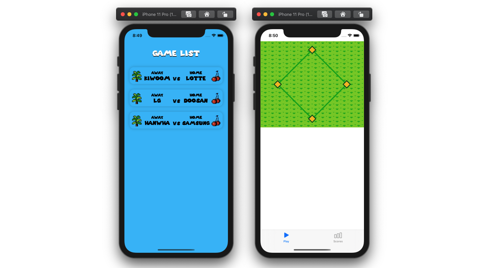
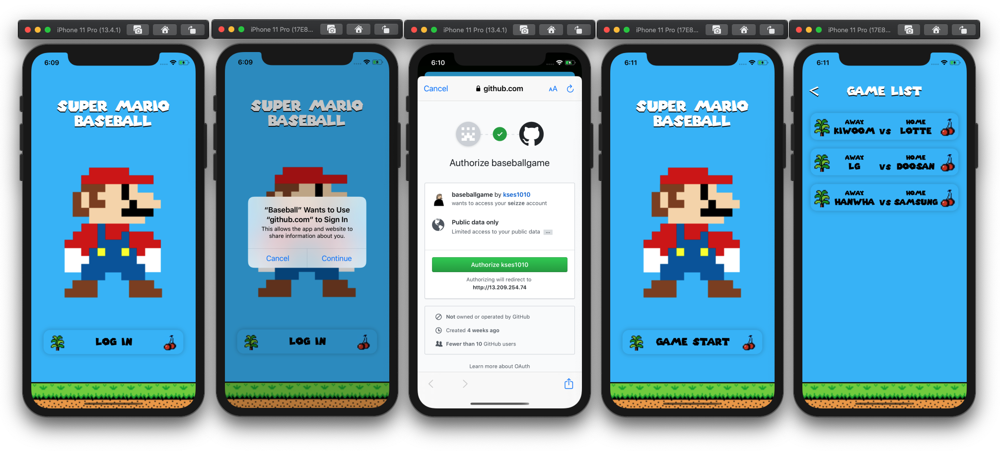

# Baseball iOS

온라인 야구게임 iOS 앱

## 단계별 구현 내용

### 매치 선택 뷰, 게임 플레이 뷰 구현

> [PR #25 [iOS] 매치 선택 뷰, 야구 그라운드 구현][pr25]

* 배경 잔디 패턴 설정
* 베지어패스를 이용하여 그라운드 그리기
* 매치 리스트 뷰, 매치 리스트 뷰모델, UseCase 구현
* URLProtocol Mock을 이용한 네트워크 Mocking 구현
* 컬렉션뷰 셀의 선택 전 상태, 매치를 기다리는 상태 등 구현

Related issues: [#6][issue6], [#14][issue14], [#22][issue22], and [#27][issue27]

**실행 결과**

#### 개선한 사항

* 게임 리스트 화면의 landscape orientation 대응
* 뷰 업데이트를 바인딩 방식이 아닌 Notification 방식으로 개선
* removeObserver가 자동으로 호출되도록 개선

### 초기 진입 화면, GitHub OAuth 로그인 기능 구현

> [PR #53 [iOS] Github OAuth를 통한 로그인 기능 구현][pr53]

* 볼록한 느낌을 주는 CALayer 커스텀 클래스 ConvexLayer 구현
* 게임 시작 버튼, 게임 리스트 셀에 ConvexLayer 적용
* GitHub 인증 후 리다이렉트를 통해 앱이 켜지도록 앱의 URL Scheme 추가
* ASWebAuthenticationSession을 이용하여 OAuth 구현
* Callback URL을 통해 전달된 사용자 인증 토큰을 관리하는 객체 구현
* 뷰모델 바인딩을 통해 로그인 정보에 따라서 로그인 뷰 업데이트

Related issues: [#28][issue28], [#29][issue29]

**실행 결과**

[pr25]: https://github.com/codesquad-member-2020/baseball-11/pull/25

[issue6]: https://github.com/codesquad-member-2020/baseball-11/issues/6
[issue14]: https://github.com/codesquad-member-2020/baseball-11/issues/14
[issue22]: https://github.com/codesquad-member-2020/baseball-11/issues/22
[issue27]: https://github.com/codesquad-member-2020/baseball-11/issues/27

[pr53]: https://github.com/codesquad-member-2020/baseball-11/pull/53

[issue28]: https://github.com/codesquad-member-2020/baseball-11/issues/28
[issue29]: https://github.com/codesquad-member-2020/baseball-11/issues/29

