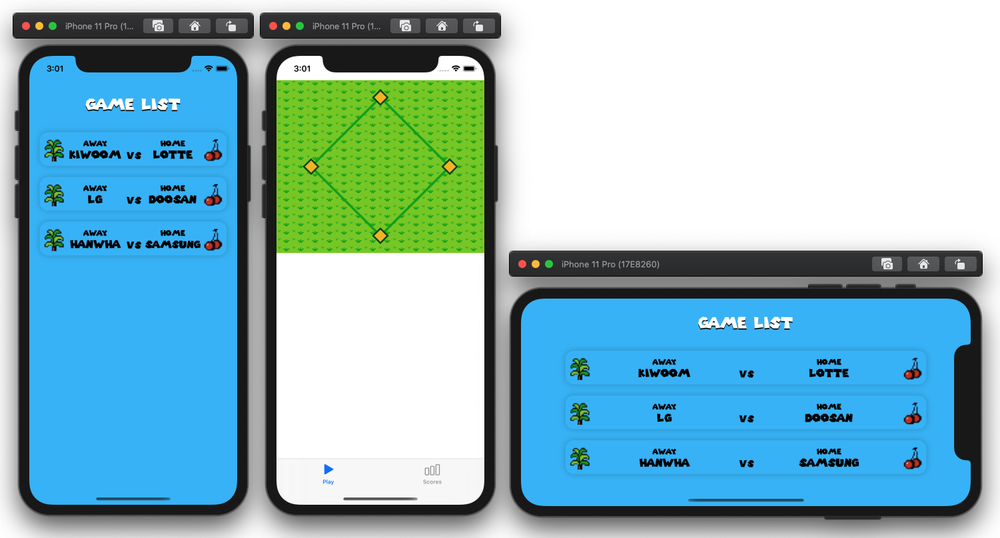

# Baseball iOS

온라인 야구게임 iOS 앱

## 단계별 구현 내용

### 매치 선택 뷰, 게임 플레이 뷰 구현

> [PR #25 [iOS] 매치 선택 뷰, 야구 그라운드 구현][pr25]

* 배경 잔디 패턴 설정
* 베지어패스를 이용하여 그라운드 그리기
* 매치 리스트 뷰, 매치 리스트 뷰모델, UseCase 구현
* URLProtocol Mock을 이용한 네트워크 Mocking 구현
* 컬렉션뷰 셀의 선택 전 상태, 매치를 기다리는 상태 등 구현

Related issues: [#6][issue6], [#14][issue14], [#22][issue22], and [#27][issue27]

**실행 결과**

#### 개선한 사항

* 게임 리스트 화면의 landscape orientation 대응

[pr25]: https://github.com/codesquad-member-2020/baseball-11/pull/25
[issue6]: https://github.com/codesquad-member-2020/baseball-11/issues/6
[issue14]: https://github.com/codesquad-member-2020/baseball-11/issues/14
[issue22]: https://github.com/codesquad-member-2020/baseball-11/issues/22
[issue27]: https://github.com/codesquad-member-2020/baseball-11/issues/27

